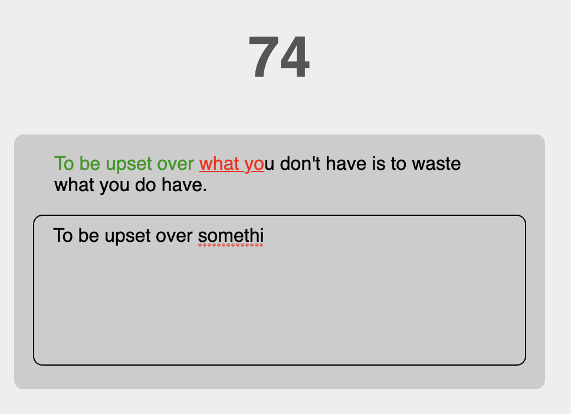

# MWA Homework 01 - ECMAScript 2015 (ES6)
## Exercise - Reactive Game
Use RXJS and convert all events, timers, ajax calls, arrays to Observables for the following Speed-Typing game.
  * Events must be registered with `fromEvent()`
  * Game Timer must be created with `interval()`
  * All arrays must be converted to Observables.
  * Fetch from: [Quotable API](http://api.quotable.io/random) must be converted to Observable
  * A new quote should be fetched when solution is correct or timer has reached 100 seconds
  
    

